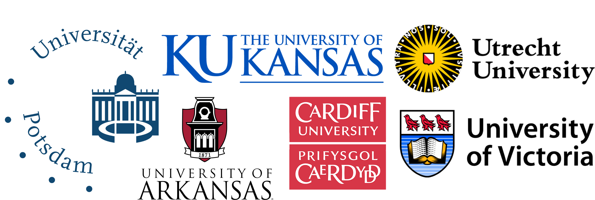

# About

## Vision

Sharing groundwater model data, knowledge and insights more easily through a portal of regional and global numerical groundwater models. The first priority is visualizing and a structured database of existing models, but the portal could eventually include model input and scripts for translating commonly used geospatial datasets into model inputs.

## Who are we?

GroMoPo is an initiative created by scientists from all corners of the world hoping to connect the groundwater modelling community and promote data and model sharing. The leading institutions and people involved in developing GroMoPo so far include the University of Victoria (Tom Gleeson and Sacha Ruzzante), the University of Kansas (Sam Zipper and Kyle Compare), Cardiff University (Mark Cuthbert), University of Arkansas (Kevin Befus), Utrecht University (Marc Bierkens, Daniel Zamrsky) and University Potsdam (Robert Reinecke). 

Collecting individual groundwater model information is the core activity of the GroMoPo initiative. This at times mundane and time consuming task has been performed by many GroMoPo volunteers and members of the worldwide academic community. Here we would like to thank each one of them individually and also encourage them to come back any time and add more groundwater models! Thank you Andres Quichimbo, Chinchu Mohan, Daniel Kretschmer, David Serrano, Emilia Leijnse, Michael Jones, Rogier Westerhoff, Xander Huggins, Taylor L. Watson, Inge de Graaf, John Richins, Grant Ferguson, Frances Dunn, Ziona Bates-Norris. 

We welcome new people and institutions to join us in our quest to collect groundwater models. If you are interested please contact any one of us!

## Data sharing

The GroMoPo database is hosted by HydroShare (https://www.hydroshare.org) and the development of the front-end application is supported by CUAHSI (https://www.cuahsi.org). We hope that in near future we will have an interactive web interface up and running and provide the groundwater modelling community with a functional toolbox to find, reuse and share groundwater model data and information. 
